# Week 1 and 2

Welcome to my weekly recaps, which I am starting in Week 2 because planning ahead is apparently not one of my strengths.

Each week, I’ll go through the matchups, cover any major moves around the league, and provide completely unbiased commentary. I’ll also make jokes, probably at your expense. Don’t worry. I’ll make fun of myself too.

Since I missed Week 1, this recap is extra long. Strap in, prepare to run it up the middle three times and punt, and hopefully laugh at least once.

## Week 1

Andy and Logan already covered the draft and everyone’s teams in the Hater’s Guide. I’m not going to redo their masterpiece.

Let’s get straight to the matchups, because Week 1 was a mess and seemingly every NFL defense decided tackling was optional.

### Ethan vs. Naberhood Creep

You will see I will will use my own nicknames for some teams as I see fit either if I a do not like

You’ll notice that I use my own nicknames for some teams. This happens for one of two reasons:

- **A)** I don’t like your current nickname.
- **B)** I feel uncomfortable typing your current nickname while sitting at my job in the library.

Ethan, I’m sorry, but I cannot sit behind that desk casually typing your full team name while people walk past me.

Anyway, onto the game.

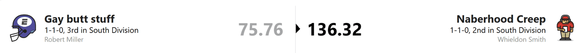

A disappointing start for Ethan, as Naberhood Creep ran straight through him.

I can confirm that the “Creep” is not Whieldon himself. If Whieldon ran into somebody, he would probably hit the floor while the other person kept walking without realizing anything had happened.

Naberhood dominated behind great performances from Hurts, Zay Flowers, and the Steelers defense. Apparently anybody could stop Cooper Rush and the Falcons this week.

Flowers looked ready to live up to his big contract, putting up around 150 yards and a touchdown in roughly half a game. Now if only his body weren’t made out of actual flower petals.

For Ethan, this week was not a smashing success. Pun unfortunately intended.

Kyle Pitts scored zero points. Drake London scored 5.5. Ethan probably spent Sunday wishing literally that it was not those two responsible for doing his name to him.

### Puka-Chu vs the Hotdog Man

Come on, Landon. You had greatness sitting right in front of you.

I respect “Nacua Matata,” but after seeing that team picture, I had to give you a new name. You are Puka-Chu now.

As for Dillon, I am not typing your entire team name every time I mention you. It is approximately the length of a congressional bill.

All I see when your score pops up is a hot dog. Therefore, you are Hot Dog Man.

Onto the matchup.

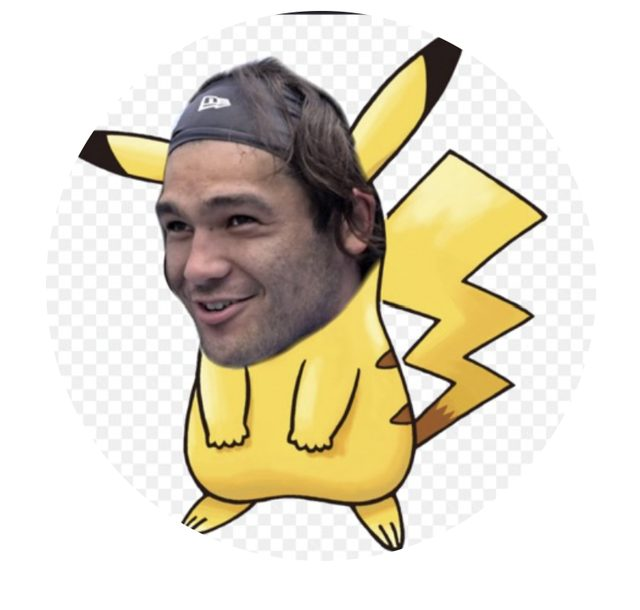

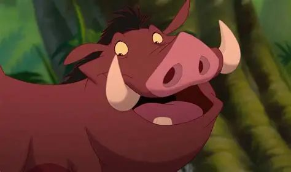

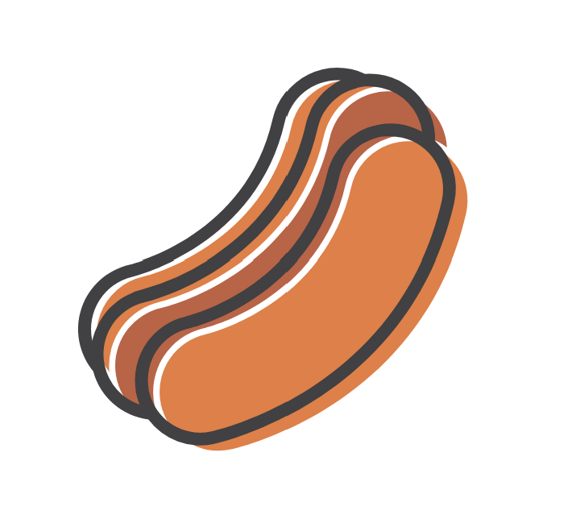

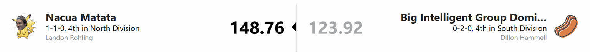

This was a good game, but it could have been much closer if Courtland Sutton and Marshawn Lloyd hadn’t soaked the bed in hot dog water.

Puka-Chu didn’t even need his usual plot armor. Puka himself scored only 12.4 points, but DJ Moore, Caleb Williams, Javonte Williams, and David Montgomery picked up the slack.

The Chus scored the MOST points in the league in Week 1. An excellent start.

But can everything stay Nacua Matata forever?

### Busts vs The Bread Maxers

Andy, your nickname is funny enough that I’m leaving it alone. What I will not be doing is spelling “Fortuitous” every time I talk about your team. That word has too many letters for my fourth grade level spelling ability.

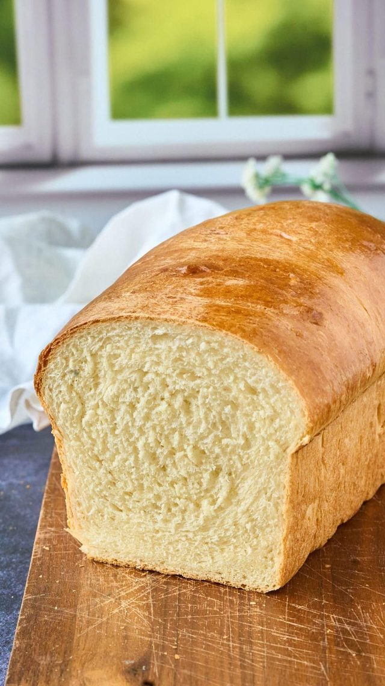

Max, I have no idea what your nickname means, so I fixed it.

Max Yeast. Bread Maxer. The man simply loves loading up on loaves.

Anyways now onto the match up:

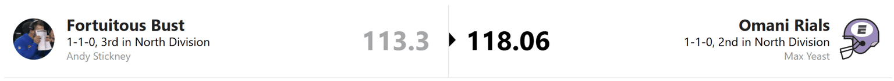

We had ourselves a nail-biter. The Busts mounted a late comeback, but K9 stalled out and Travis Kelce scraped together just enough points to drag the Bread Maxers across the finish line.

The Busts were extremely boom-or-bust, which is at least good branding. Almost all their production came from Ladd, K9, and Olave. Everybody else apparently decided Week 1 was optional.

The Bread Maxers delivered a beautifully mediocre team performance outside of Derrick Henry dropping 35.3 points and the Browns defense scoring minus one.

The Busts probably just had some Week 1 jitters.

Surely Andy won’t panic and make a dramatic roster decision.

Surely this is not foreshadowing.

### The Talking Tuas vs The Kirk Offs

Both nicknames are fine. Could they be better? Probably. Do I have a better idea? No.

Moving on.

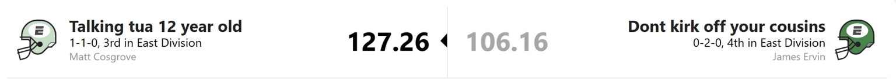

This matchup was kind of... eh. Both teams got big games from their top players and disappointment from much of the rest.

The Talking Tuas got 24.96 points from Lamar, 33.6 from Gibbs, and 32.7 from Jeanty. Unfortunately, the rest of the roster, including Tua, the literal man they named themselves after, mostly responded with a shrug.

The Kirk Offs had a similar problem. Justin Jefferson did everything he could with 31.2 points. Breece Hall added 19.8, and Jayden Daniels put up 17.66. That would have been great if more of the roster had shown up.

Overall, James will not be Kirking Off to this performance anytime soon.

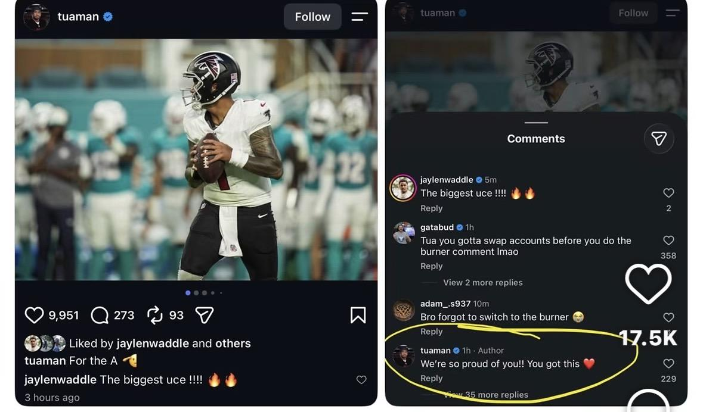

### Bassment Lover vs. Crasshee and Dart

Robert, I’m sorry, but your full team name is getting cut too. I’m not typing all that every week. Brady’s name is short enough to survive. Now onto the game.

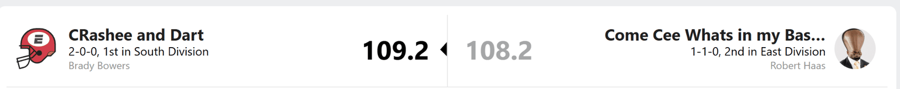

WOW. A legitimate nail-biter.

But wait. Robert LOST a close game?

Mr. Plot Armor? Mr. Inevitable? The prophecy has been broken?

I’m new to this league, so everything I know about Robert’s legendary plot armor comes from stories passed down through generations. Apparently, though, the man is mortal.

Robert’s trademark strategy of “everybody score a decent amount and somehow I win” was not quite enough to overcome Brady’s three speeding cars: Trey McBride, Jaxson Dart, and Bijan Robinson.

Rashee Rice crashed out with only 9.2 points, but the Crashees kept driving.

Robert’s inevitability has officially stalled. At least for one week.

### Sleepy Joes vs. The Punters

Logan and the Sleepy Joe Flaccos, which is unfortunately a great team name, faced my team: Inside Zone x3 Aww Punts.

Yes, after criticizing everybody else’s long names, I have realized mine is also too long. Hypocrisy builds character. From now on, I’m calling myself the Punters.

Onto the matchup.

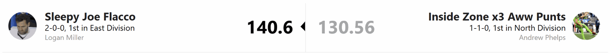

Well. That sucked.

I scored the THIRD-MOST points in the league and still lost. If you’ve watched me play fantasy football before, this is probably the least surprising development imaginable.

Credit where it’s due: Sleepy Joe put up the second-highest score of the week. He emerged from his dad nap, commanded his team to victory, and immediately returned to sleep.

Trevor Lawrence, the Sun God, and Swift had big games. McPherson and Travis Etienne also put together respectable performances.

Unfortunately for Logan, A.J. Brown got hurt. Thankfully, it’s not like Logan could somehow turn an injured A.J. Brown into a significantly more valuable player through a trade immediately afterward. That would be ridiculous.

As for the Punters, it was a decent week despite the loss. JSN looked like the second coming even with Drew Lock under center, and Josh Allen continued his lifelong commitment to being Josh Allen. Isaiah Likely showed out, and Kyren had a respectable game.

The rest of my roster resembled a condemned trailer parked next to three Bugattis. I have no idea why Tony Pollard was in my flex. Outside of Chuba Hubbard, my bench looked like something you’d find beside the dumpster behind a Dollar General.

And with that, Week 1 is over.

## TRADE ALERT

**BREAKING NEWS. WELL, NOT BREAKING ANYMORE. BUT IT WAS BREAKING AT THE TIME. THE BUSTS AND SLEEPY JOE FLACCO MADE A TRADE AFTER WEEK 1.**

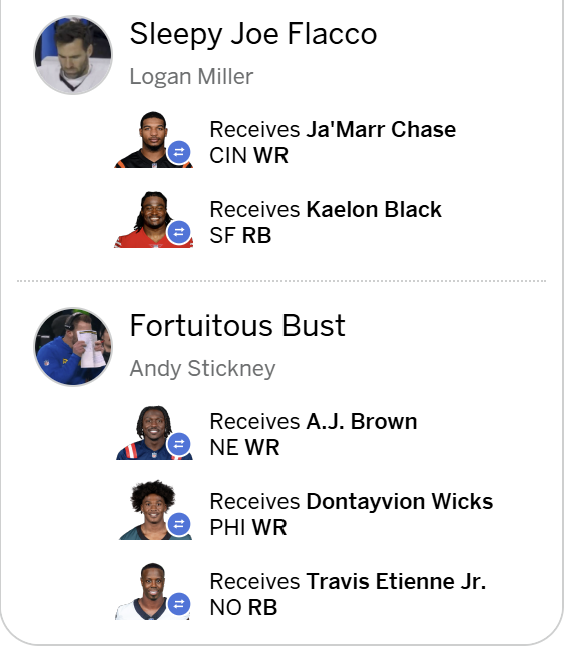

After a lackluster start, Andy decided the Busts needed depth. He sent Ja’Marr Chase and waiver pickup Kaleon Black to Sleepy Joe in exchange for A.J. Brown, Dontayvion Wicks, and Travis Etienne.

Robert “Megamind” Hass reportedly could not comprehend this decision and even took time before an interview to talk trash about Andy’s trade.

However, this might be the rare win-win trade.

Logan gets another superstar receiver for a title run. Andy gets depth to protect himself from finishing last and having to eat **THE CHIP**. Frankly, who knows what **THE CHIP** would do to frail Andy’s immune system?

Perhaps self-preservation outweighed championship ambition.

A.J. Brown going to IR means this probably won’t help Andy much over the next few weeks. Down the stretch, though, the extra depth could keep him out of last place.

**MEGAMIND ROBERT CANNOT COMPREHEND THIS STRATEGY.**

**“WHY NOT SIMPLY RECONSTRUCT YOUR ENTIRE TEAM THROUGH WAIVERS AND DUMB LUCK?”**

Excellent question, Robert.

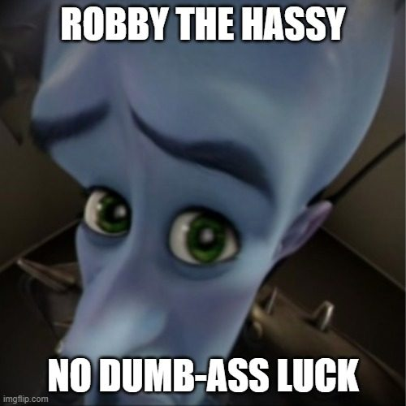

## Week 2

After all those Week 1 shenanigans, surely things cannot get worse.

Right?

No long preamble this week. Straight to the matchups.

### Crashee vs. Hot Dog Man

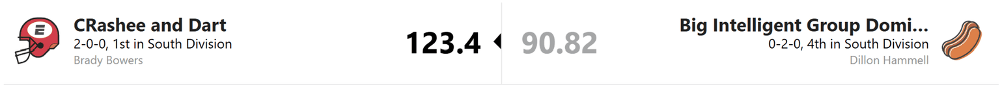

Hot Dog Man? More like Hot Dog Water.

Dillon’s team had a rough week, with Jonathan Taylor looking like the only functioning piece of the operation. Marshawn Lloyd is not filling the hole left by Josh Jacobs, and the running back room is currently held together with duct tape, hope, and whatever goes into gas-station hot dogs.

The good news for Mr. Hot Dog is that he might be healthier by around Week 7.

The bad news is that by Week 7, playoff contention may already be a fond memory.

Bucky Irving should still provide decent points, but “decent” does not save a roster from drowning. Why I wanted to trade for him remains a mystery that historians will study for centuries.

Then there’s Drake “The Schedule” Maye, who couldn’t reach double-digit fantasy points in a win. There are some useful pieces on this roster, but right now, nothing looks ready to push it over the top.

Good luck, Dillon. You’d better hope this team wakes up before **THE CHIP** starts looking like dinner.

As for Brady and the Crashees: good win. You did what you were supposed to do.

That sounds positive until you realize I’m about to ruin it.

A 2-0 start is great, but I’m not convinced this is a championship monster yet. The team met expectations even with one of its namesakes going down, and you have the high-flying Tyler Shough on the bench while Dart gets healthy.

The Crashees look solid. Probably playoff-bound. Maybe not terrifying yet.

But 2-0 is 2-0.

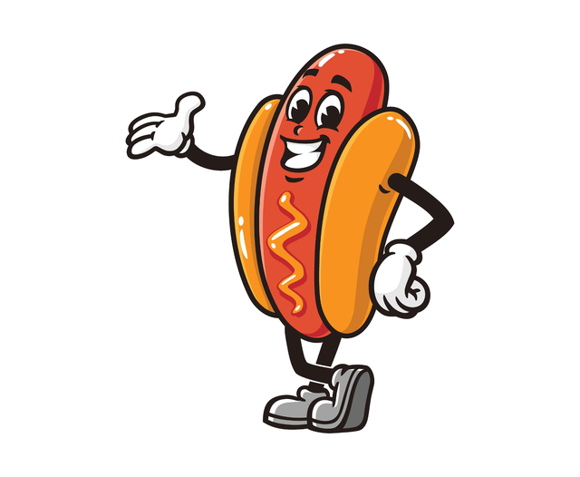

### Talking Tuas vs Robert the Inveritable

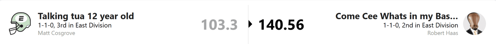

Well, well, well.

Robert apparently took all his anger from losing to Crashee, went home, performed several forbidden rituals, and unleashed it on the Talking Tuas.

This one was a beatdown.

Robert’s stars played like stars, and the few disappointing performances on his roster weren’t enough to drag him down. You could worry about Mike Evans’ health. You could worry about Jeremiah Love looking a little underwhelming. You could question whether Dak can keep putting up huge numbers every week.

But Robert has enough depth that he may barely need waivers outside of quarterback.

Normally, I would question a team relying so heavily on Cowboys players. After hearing the ancient stories about Robert’s fantasy football witchcraft, I’m beginning to think the normal rules do not apply to him.

As for the Talking Tuas, one word sums up this week:

Disappointment.

Lamar? Disappointing.

Jeanty? Disappointing.

Emeka? Disappointing.

Pickens? Also disappointing.

Keep your head up. You may have simply encountered Robert’s black magic.

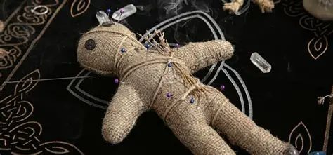

### Sleepy Joe Flacco vs. Puka-chu

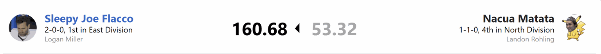

Sleepy Joe apparently studied his Pokemon type matchups and brought a Ground type specifically to deal with this troublesome electric mouse.

Puka-Chu went from the highest-scoring team in Week 1 to suffering the largest loss in Week 2. That’s fantasy football, baby.

The Ja’Marr trade is looking beautiful for Sleepy Joe. When asked for comment, Joe briefly awakened from his dad nap and reportedly muttered:

“F it. Ja’Marr is down there somewhere.”

Then he went right back to sleep.

The Sleepy Joes didn’t even need an incredible running back performance. Ja’Marr and the Sun God were busy nuking the opposing team from orbit.

Logan also displayed elite managerial instincts by starting Bryce Young over Trevor Lawrence, almost as if his dad nap gave him a vision of Lawrence’s disappointing game before it happened.

For Puka-Chu, the mascot was out with an injury, and apparently he took the team’s plot armor with him. The dam broke, and there were too many disappointing performances to list without turning this into a medical report.

DJ Moore and Caleb Williams also got hurt, so the injury bug appears to be working its way through the roster. It is too early to panic after one bad week. It is, however, perfectly reasonable to stare at your lineup in silence for a while.

### Kirk Off vs Ethan

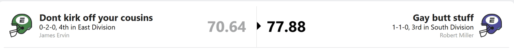

Can you tank in a league that punishes last place?

James and Ethan appear determined to find out.

Neither team had much go right. James can probably call this an off week. Ethan’s problems are starting to look less like an off week and more like a roster inspection that failed at every station.

To make matters worse, both teams left their highest-scoring players on the bench. The points were right there. They just weren’t allowed into the building.

Also, why do you both have two defenses? Are you expecting one of them to play offense?

If things continue like this, we could see a Kirk Offs–Ethan rematch in the toilet bowl, with **THE CHIP** waiting for the loser.

### The busts vs Naberhood Creep

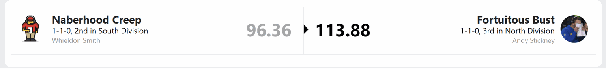

Good news for Andy trading away Ja’Marr Chase did not immediately cost him a win, despite Ja’Marr having a huge week.

Bad news for Andy the next few weeks still look like a fight to keep his head above water until A.J. Brown returns.

K9 is doing a lot of the heavy lifting, but can he keep up this pace? He has never had this much usage without injury in his carrer.Travis Etienne disappointed in his Busts debut, though Dontayvion Wicks looks like he could be a useful depth piece. If the rest of the roster gets back on track, Andy might be fine.

That “if” is currently doing about as much work as K9.

For Naberhood Creep, James Cook had a great game. Whieldon probably wishes Josh Allen had shared a few of those touchdowns with him, though.

The Busts got the win, but they’ll be crossing their fingers every week for above expectations performances to win. As for the Creeps they will want Zay Flowers back and will be hoping his Week 1 performance was a preview, not a one-week special.

### Bread Maxer vs The Punts

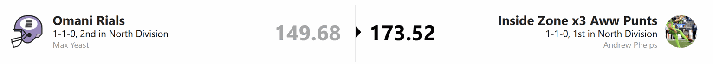

Oh, how the turntables.

Last week, I scored the third-most points and lost. This week, the Bread Maxers scored the third-most points and lost to me.

I would offer sympathy, Max, but I’ve only just recovered from my own complaint about this exact situation.

The Christian McCaffrey and Brock Purdy stack looked great for the Bread Maxers. CMC keeps piling up receiving touchdowns, though I’d like to see how the running game holds up when a tougher opponent makes things less comfortable than the jetlagged rams and the dolphins.

As for the Punters

Josh Allen: 40.82 points.

JSN: 42.5 points.

If I had lost with those two performances, I would have skipped the rest of the season and eaten **THE CHIP** voluntarily.

Thankfully, the rest of my roster showed up too. Last week, my team looked like a couple of Bugattis parked beside a run down trailer. This week, nearly everybody got the engine running with a few minivans broken down on the side of the road.

We will ignore any mechanical noises coming from the bench.

## Standings

### Analysis

In the North, everybody is 1-1, so nobody gets to act superior yet. Puka-Chu’s huge Week 1 wasn’t enough to cushion that Week 2 blowout. The Busts need to hang on while A.J. Brown is out, the Bread Maxers need to keep scoring, and the Punters need Josh Allen and JSN wrapped in bubble wrap.

In the East, Sleepy Joe looks like the team to beat. Logan’s receiver room is stacked, and his biggest concern may be whether the running backs stay healthy. Robert is lurking behind him, presumably assembling a playoff roster out of waiver claims and forbidden magic. The other two teams have some catching up to do.

And in a twist, the South might be the weakest division. Crashee and Naberhood Creep lead it, while Hot Dog Man and Ethan are already looking nervously toward **THE CHIP**. It’s early, but neither team should get too comfortable.

### SUPERLITIVES

- **Most points for:** Punts 304.08
- **Least points for:** Ethan 153.64
- **Most points against:** Punts 290.28
- **Least points against:** Sleepy Joe 183.88
- **Biggest Blow Out:** 107.26

  

- **Closest game:** 1

  

- **Highest Scoring Player:** Josh Allen 76.48
- **Worst Game:**

  

- **Highest scoring Game:** 323.2

  
