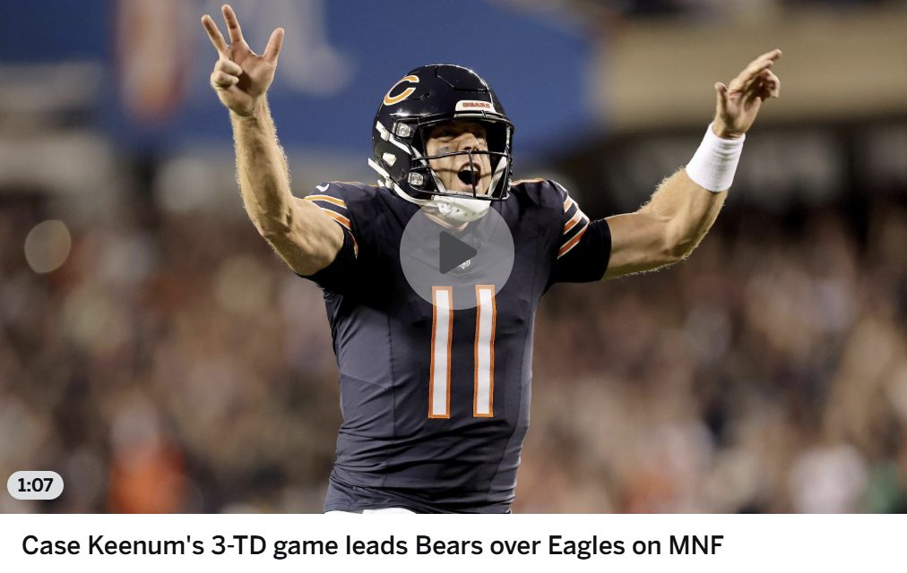
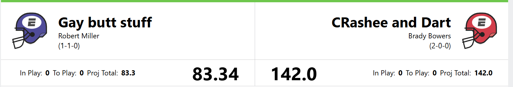
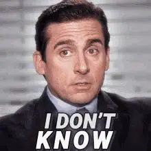
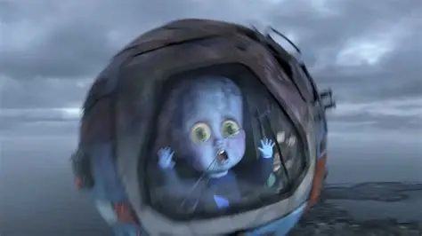
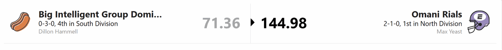
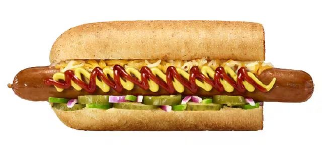
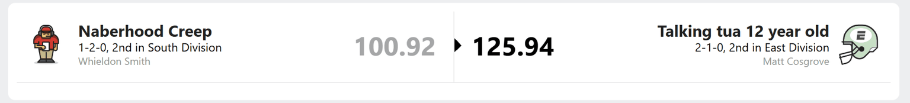
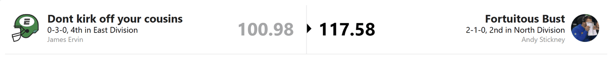
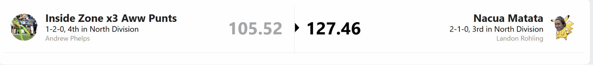

# Week 3

Welcome to Week 3, where the NFL apparently decided that predictions were more of a suggestion.

The Browns and Raiders both won. The mighty Rams fell to 1-2. My Seahawks had their 12 game streak snapped by Marcus Mariota and the Commanders. Then, on Monday night, Case Keenum and the Bears beat the Eagles. Keenum might have had an even better game if his receivers had remembered the “catching” part of being receivers.

Meanwhile, the Vikings are 3-0 without Kyler Murray after trading away the first round quarterback they recently drafted for a fifth round pick. Naturally.

Injuries are everywhere, teams are starting backup quarterbacks, and it is somehow only Week 3. Our fantasy league has responded by becoming just as chaotic.

## Ethan vs Crashee and Dart

Holy blowout.

Somehow, even when Ethan’s favorite team wins, Ethan finds a way to lose.

The Falcons bounced back, and Drake London gave Ethan a good game. Unfortunately, Kyle Pitts contributed 1.5 points, which is less a fantasy performance and more a notification that he was technically present. Ethan may need to rethink his tight end strategy.

Then Bijan Robinson, another Falcon, dropped nearly 40 points for Brady. So Ethan got to watch his favorite team succeed while its best fantasy performance landed directly on his head.

It didn’t help that much of Ethan’s starting lineup played like it belonged on the bench. The problem is that the bench wasn’t offering many solutions either.

As for the Crashees, losing the “Dart” half of their name to a season ending injury hasn’t slowed them down. Bijan, Stroud, and Adams are carrying the team, and Brady is starting to look dangerous.

Perhaps it’s time to rename the team “Crashee and Whoever Is Healthy.”

## Big man MegaMind Robert vs The Sleepy Joe’s

Robert lost. Again.

Is that allowed? Has anybody checked the league bylaws?

Robert appears to have spent all his black magic slowing down the Sun God. Unfortunately, he forgot Logan has other players. Ja’Marr Chase and George Kittle carried the Sleepy Joes, while Trevor Lawrence, Parker Washington, and Bhayshul Tuten chipped in solid performances.

Logan’s commitment to collecting Jaguars has confused some people, but so far, the results are hard to argue with. We’ll see how long that lasts before the Jaguars remember they are the Jaguars.

For now, Logan and Brady look like the two teams fighting to be the title favorite.

Robert, meanwhile, needs something unusual for him: a little luck. Andy tells me Robert is long overdue for this kind of misfortune, so I’ve been instructed not to feel too bad.

## The Hot dog Man vs the Bread Maxer’s

Dillon continues to be Hot Dog Water, which was a welcome break for the Bread Maxers after facing the league’s highest scoring team last week.

Hot Dog Man’s roster shit the bun. Christian Watson and the Lions defense showed up; nearly everybody else finished well below projection. At this point, Jonathan Taylor may need to play three positions at once.

The Bread Maxers, meanwhile, kept farming carbs with good performances across the roster. Max now has a real shot at taking control of the North.

Dillon is headed in the opposite direction, with **THE CHIP** growing larger in his rearview mirror. Finding a quarterback who can produce more than Drake “Hot Dog Sub” Maye would be a good start.

## The Creeps vs The Talking Tua’s

The Creeps underperformed. The Talking Tuas did about as well as expected, although probably not in the way Matt expected.

Jahmyr Gibbs scored 41 points and dragged much of the Tuas’ roster across the finish line. It was less a team effort and more Gibbs pulling a wagon full of people who said they were “helping.”

The Creeps gave Whieldon a thoroughly average week. Nobody completely saved the team, but nobody provided a spectacular disaster either. His roster isn’t the worst in the league, and it certainly isn’t the best.

The same can be said for the Talking Tuas, except they had Gibbs and won. Sometimes one guy doing the work of an entire department is enough.

## The Kirk offs vs The Busts

Maybe Andy complained about Robert so much that the universe transferred Robert’s powers to him.

Or maybe James and the Kirk Offs just stink.

Probably the latter.

To be fair, about half of James’s team is injured. Would a healthy roster have changed the result? Maybe. Unfortunately, the injury report does not give you fantasy points for what could have been.

It’s shaping up to be a long season for the Kirk Offs. James may need to focus less on the playoffs and more on avoiding a date with **THE CHIP**.

For Andy, the win is nice, but that Ja’Marr Chase trade looks rough right now. A.J. Brown is out, Travis Etienne is now injured, and Andy has effectively exchanged one of the league’s best receivers for a half eaten bag of chips and a promise that things might improve later.

At least some of his bench players finally scored. That’s progress, even if it happened while they were sitting on the bench.

## The Punters vs the Puka-Chus

Apparently, when one of my Bugattis hits a speed bump, the entire Punters roster falls apart.

Josh Allen didn’t even have an awful fantasy game. But if Allen and JSN don’t both put up ridiculous numbers, my team suddenly forgets how to function.

Isaiah Likely vanished after the Jaxson Dart injury. Jaylen Waddle is about as consistent as picking a random answer on a multiple choice quiz. I also kept Jadarian Price in my lineup after Andy talked me into it.

I’m not blaming Andy. I made the decision. I am simply recording his involvement for the historical record.

Puka-Chu, meanwhile, performed a little above expectations. Brock Bowers and Jaylen Warren had big days, and that was more than enough to beat my collection of disappointed expectations.

The concern for Landon is Puka’s groin injury and the possibility of surgery. Puka-Chu can win without its mascot for a week, but losing him for longer could put a serious cap on the team’s ceiling.

As for me, I’m going to park the Bugattis in the garage and hope they start next Sunday.

That’s it for Week 3. There won’t be a standings breakdown or superlatives this time because I have a lot of shit to do.

Goodbye, and may your starters score more than the players you left on the bench.

