# WEEK 4 RECAP

Welcome back to the weekly recap. Week 4 was dizzying, several teams forgot how to play football, and I have once again been given a reason to rename Dillon’s team.

Let’s get into it.

## HOT DOG PISS VS. THE CREEPS

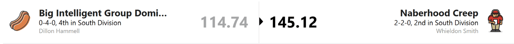

Dillon, you may have noticed that I changed your name again. “Hot Dog Man” was too generous. “Hot Dog Water” was also too generous.

You are now Hot Dog Piss.

At 0-4, you finally benched Drake Maye, only for him to have his best game of the season. Yes, he had been terrible. But surely there was an option somewhere between “keep starting Maye” and “put Jacoby Brissett in charge.”

Jonathan Taylor, Nico Collins, and your kicker were the only bright spots. Everybody else contributed just enough to make the final score look more respectable than the performance actually was.

The name stays until you win a game.

The Creeps, meanwhile, posted the highest score in the league this week. Nabers, Flowers, and LaPorta went off, and the rest of the roster did its job. Whieldon looked genuinely dangerous. Of course, that means he now has to deal with the highest-scorer curse. Max may have broken it, but with injury concerns starting to pile up, I wouldn’t celebrate just yet.

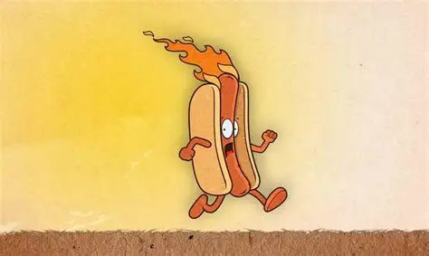

## THE BREAD MAXERS VS. CRASHEE AND DART

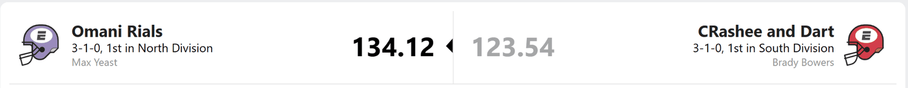

The Bread Maxers prevailed in a matchup between two of the league’s best teams.

Brady’s team is still named after Jaxson Dart and Rashee Rice, which is becoming less of a team name and more of an injury report. Dart is hurt, and Rice left early this week with a zero. That donut may have cost Brady the game.

Max didn’t need one player to carry him. The Bread Maxers simply got solid performances across the lineup. Every time you looked at the matchup, another player had quietly added points. That kind of consistency is terrifying because the bread never stops rising.

This loss stings for Brady, but he remains comfortably ahead in the South. ESPN still gives him better than a 70% chance of making the playoffs. His season is fine.

His team name, however, could use healthy players.

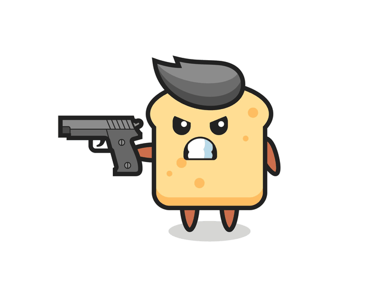

## THE BUSTS VS. PUKA-CHU

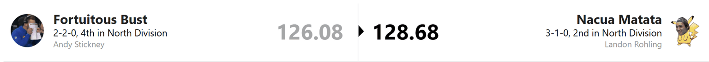

OOF. A nail-biter.

Puka-Chu won his second straight game and made that Week 2 disaster look more like a fluke than a warning sign.

For Andy, this one hurts. DK Metcalf, C.J. Stroud, and even J.K. Dobbins were sitting on the bench with enough points to change the result. The winning lineup was right there; it just wasn’t allowed onto the field.

Meanwhile, Puka-Chu continues to run one of the strangest rosters in the league. The stars show up, everybody else operates according to rules known only to Landon, and somehow it keeps working.

I’d call it plot armor, but after two straight wins, I’m starting to worry he may actually know what he’s doing.

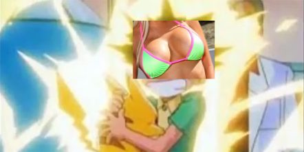

## THE MOLESTOR OF THE DISHONORABLE ROBERT VS PROBABLE MOLESTER

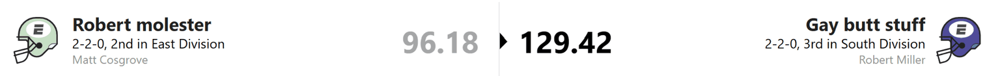

Ethan was jealous, jealous that Matt got to do all the non-consensail sex stuff instead of him he has been begging for it for years.

So Ethan got out his Tetora Belt and whipped Matt into submission.

Mcmillain scoring 45.2 points the only other notable performance from the gay but dude was Carnell Tate but that was fine as ethan personally went over to all the NFL games that the Robert Molestors where playing in and butt fucked the players.

Some liked it better than others. It was a hoot in the Cowboys locker room however not the player that Ethan did to it as Ceddee Lamb was so excited by it he decided to take all of Picken's targets hoping Ethan would do it to him next.

## SLEEPY JOES VS. THE KIRK OFFS

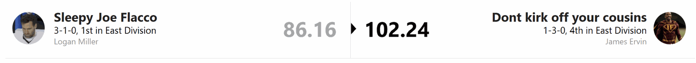

Joe? Joe, wake up. You have a game.

Logan and the Sleepy Joes apparently slept through Week 4 and somehow lost to James and the Kirk Offs.

On paper, Logan had the better players at almost every position. Unfortunately, fantasy football scores are based on what players do during the game, and most of the Sleepy Joes did very little.

James got the win, but I wouldn’t hang this performance in a museum. Saquon is banged up, the rest of the starting lineup looks shaky, and the bench resembles an infirmary waiting room.

Still, a win is a win. James can enjoy this one while Logan sets twelve alarms for next Sunday.

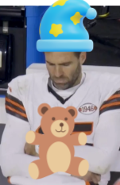

## THE PUNTERS VS. ROBERT THE INEVITABLE LOSER

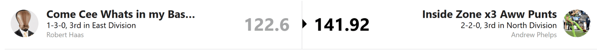

Robert. Come here for a second.

Remember all that talk about your black magic? About being inevitable? About how everybody else should simply get better?

How’s that going?

It looks like Robert made voodoo dolls of Josh Allen and JSN, because neither gave me the massive game I’ve come to depend on. What Robert didn’t account for was Kyren Williams and Chuba Hubbard picking up the slack.

You stopped two players and accidentally woke up the rest of my roster. That is some impressively inefficient wizardry.

CeeDee Lamb did his best to keep Robert alive, but it wasn’t enough. Andy, of all people, is probably enjoying this result almost as much as I am.

“The Inevitable” is starting to sound less like a nickname and more like what Robert called this loss before it happened.

## STANDINGS ANALYSIS

Back by popular demand, meaning Andy and Logan asked for it, here is the divisional standings analysis.

### THE NORTH

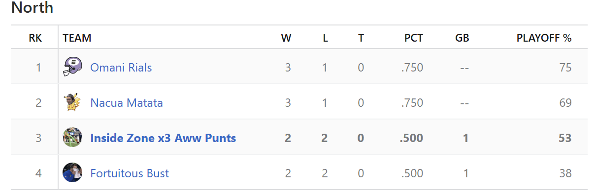

I might be biased, but is this the best division?

Everybody is at .500 or better. The division has the league’s two highest-scoring teams and the top-ranked team. Every matchup feels like it matters, and apparently none of us are allowed an easy week.

I would appreciate it if one of you could start being bad.

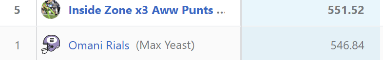

### THE SOUTH

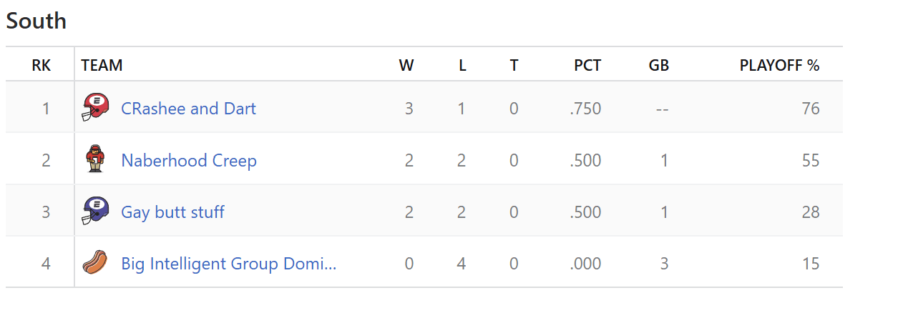

These standings are a little misleading.

Whieldon has taken care of business inside the division but has yet to win outside it. Ethan won this week but still has the fewest points scored in the league. Dillon is 0-4 and has just been renamed Hot Dog Piss, which tells you everything you need to know about how his season is going.

Brady looks strong. The rest of the division is fighting over who gets to say, “At least I’m not last.”

### THE EAST

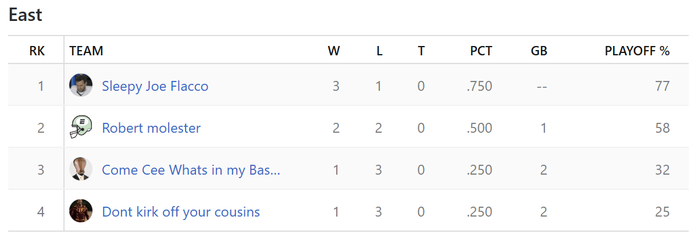

Why do I have to play in the North?

When Logan’s players are on, the Sleepy Joes might be the best team in the league. This week proved they are also capable of sleeping through an entire matchup.

I’m mostly jealous that the East appears to offer a couple of easier games while my division is busy trying to eliminate itself. Robert may have lost his magic, James’s bench needs a medical staff, and somehow I’m the one stuck playing in the North.

That’s Week 4. I’ll see you next week, assuming Dillon’s team name doesn’t require another downgrade.
